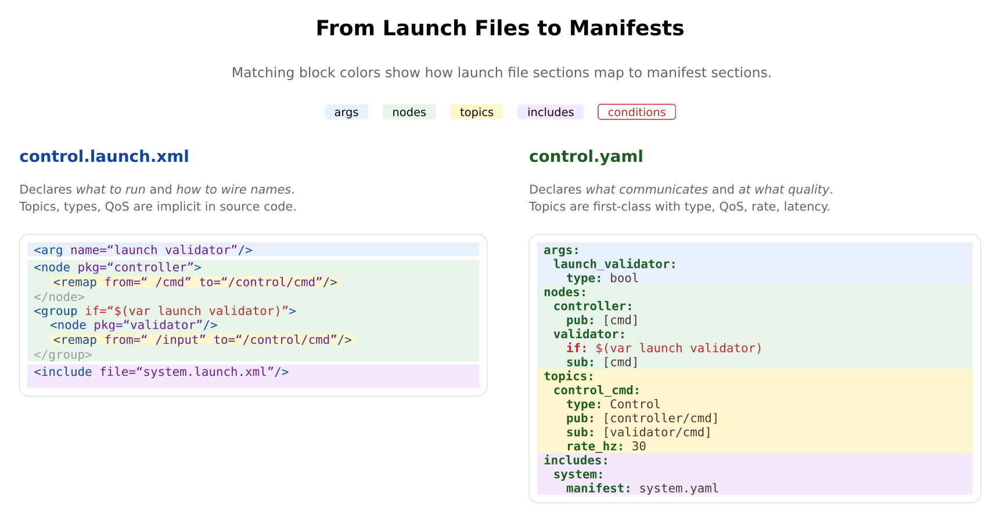
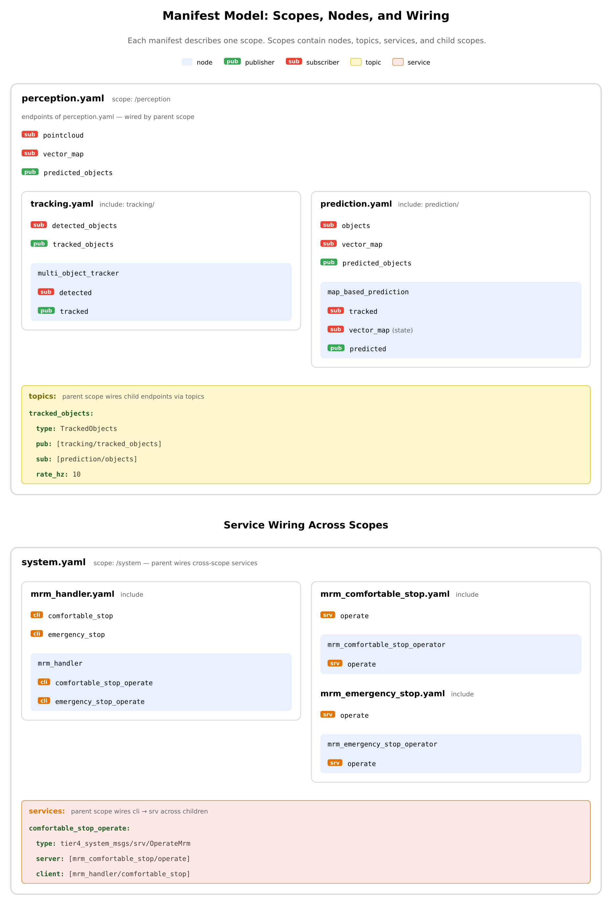

# Launch Manifest

*This is the manifest format specification. For the formal theory
behind timing contracts and composition rules, see
[contract-theory.md](contract-theory.md).*

## Introduction

ROS 2 launch files declare which nodes to run but not which topics they
create. Topic creation happens in source code — publishers and subscribers
are invisible until runtime.

A **launch manifest** is a sidecar YAML file that describes what one launch
file contributes to the communication graph: its nodes, their endpoints,
the topics and services that wire them, and optional timing contracts.
Where a launch file says *what to run*, the manifest says *what communicates
and at what quality*.

**Terminology:** "manifest" is the document; "contract file" is the file
that carries it on disk (`<stem>.contract.yaml`, matching the launch
file's stem). The two are used interchangeably — CLI surfaces
(`--contracts`, `--no-provider-contracts`) say "contract", the format
model says "manifest". They are one artifact, not two.

**How to read this document:**

- **[Manifest Elements](#manifest-elements)** — the building blocks: scope, node, topic, path, etc.
- **[Background](#background)** — design principles, dataflow patterns, contracts, timing, and timestamps.
- **[Worked Example](#worked-example)** — a complete multi-scope perception pipeline.
- **[Format Reference](#format-reference)** — field-level syntax lookup for writing manifests.
- **[Vocabulary v2](#vocabulary-v2)** — `trigger:`, `sync:`, `buffer:`, `chains:` (Phase 44.1).
- **[Static Validation](#static-validation)** — checker rules and example diagnostics.

## From Launch Files to Manifests

A manifest mirrors the launch file it describes. Each launch file concept
maps to a manifest element. Matching colors show the correspondence:



| Launch XML | Manifest YAML | What the manifest adds |
|------------|---------------|------------------------|
| `<arg>` | `args:` | Typed parameters: bool, choices, string |
| `<node>` / `<group>` | `nodes:` | Named endpoints (pub/sub/srv/cli) |
| `<remap>` | `topics:` | First-class wiring: type + QoS + rate |
| `if="$(var ...)"` | `if:` / `unless:` | Conditions on any entity |
| `<include>` | `includes:` | Child scope with its own manifest |
| *(in source code)* | `paths:` | Timing contracts: latency, age, drops |

The key difference: in launch files, topics are implicit in source code
and connected via `<remap>`. In manifests, topics are **first-class** —
declared with message type, QoS, and rate, and explicitly wired to node
endpoints.

### Directory Structure

Contracts are resolved through two channels, checked in order for every
scope (first hit wins): **overlay** then **provider**. Both derive the
same `<stem>` from the launch file — strip the `launch/` subdirectory and
`.launch.xml` / `.launch.py` extension, append `.contract.yaml`.

**Provider sidecar** (on by default) — the contract ships right next to
the launch file it describes, in the package's own install tree:

```
share/
├── tier4_control_launch/
│   └── launch/
│       ├── control.launch.xml
│       └── control.contract.yaml
├── tier4_system_launch/
│   └── launch/
│       ├── system.launch.xml
│       └── system.contract.yaml
└── autoware_launch/
    └── launch/
        ├── planning_simulator.launch.xml
        └── planning_simulator.contract.yaml
```

This is the natural home for a contract a package maintainer ships
alongside their own launch file: `<launch-file-dir>/<stem>.contract.yaml`.
Disable it with `--no-provider-contracts` (`play_launch check`/`launch`).

**User overlay** (`--contracts <dir>`) — a separate tree, keyed by
`package/launch/stem.contract.yaml`, for contracts a downstream user
supplies without touching (or having write access to) the installed
package:

```
<dir>/
├── tier4_control_launch/
│   └── launch/
│       └── control.contract.yaml
├── tier4_system_launch/
│   └── launch/
│       └── system.contract.yaml
└── autoware_launch/
    └── launch/
        └── planning_simulator.contract.yaml
```

The overlay channel is checked first, so an overlay entry always wins
over a provider sidecar for the same scope — useful for patching a
contract without rebuilding the package. `pkg: None` scopes (a launch
file referenced by raw path, not through a ROS package) use the `_`
convention in both channels: `<dir>/_/launch/<stem>.contract.yaml`.

The flat `<manifest-dir>/<pkg>/<stem>.yaml` layout (`--manifest-dir`) was
the original transitional channel and has been removed (Phase 40.6) now
that every known user has migrated to the provider/overlay layout above.

## The Manifest Model

A manifest describes a **scope** — one launch file's contribution to the
graph. Scopes contain nodes, topics, services, and child scopes.



### Manifest Elements

- **Scope.** A manifest file describes one scope. A scope corresponds to
  one launch file (or one `<group>` block). Scopes form a tree that
  mirrors the launch file include hierarchy. The scope's namespace
  (from the launch tree) determines how relative topic keys are resolved.
  See [Scopes](#scopes), [Includes](#includes),
  [Directory Structure](#directory-structure).

- **Node.** A leaf execution entity — a ROS 2 node or composable node.
  Declares named **endpoints**: pub, sub, srv, cli. Optionally declares
  causal **paths** with timing constraints. Composable nodes appear as
  regular nodes — the container is a deployment detail. A composable node
  belongs to the manifest of the launch file that contains the
  `<load_composable_node>` tag, not the container's launch file.
  See [Nodes](#nodes).

- **Endpoint.** A named port on a node. Four kinds: `pub` (publishes),
  `sub` (subscribes), `srv` (serves a service), `cli` (calls a service).
  Endpoints can have properties: rate, jitter, state, required, max_age_ms.
  See [Nodes](#nodes),
  [Subscriber Modes](#subscriber-modes-state-and-required).

  Endpoint names are **local to the node** within the manifest. The
  `topics:` section wires endpoints to ROS topics using `node/endpoint`
  refs:

  ```yaml
  nodes:
    controller:
      pub: [cmd]                   # "cmd" is the endpoint name

  topics:
    command/control_cmd:
      pub: [controller/cmd]        # node_name/endpoint_name
  ```

  `pub:` / `sub:` appear at two levels — don't confuse them:
  - On a **node** — declares endpoint names (`pub: [cmd]`)
  - Inside a **topic** — lists which endpoints are wired (`pub: [controller/cmd]`)

- **Topic.** First-class wiring between endpoints. Topic keys are **ROS
  topic names** — either relative or absolute. See
  [Topic Name Resolution](#topic-name-resolution), [Topics](#topics),
  [Quality of Service](#quality-of-service),
  [Timestamps and Data Flow](#timestamps-and-data-flow).

  The same topic can appear in multiple manifests across the scope tree.
  Contract fields (`type:`, `rate_hz:`, topic-level `qos:`) must agree
  across all declarations; `pub:` and `sub:` endpoint lists are merged
  by the checker. Per-endpoint `qos:` overrides live on a node and are
  local to its declaring scope. Each scope only references its own nodes
  in endpoint lists.

- **Service / Action.** Request-response wiring. Service and action keys
  follow the same naming rules as topics — ROS names, relative or
  absolute. The same service can appear in multiple manifests; `type:`
  must agree, `server:`/`client:` are merged.
  See [Services and Actions](#services-and-actions).

- **Include.** A child scope. Maps to `<include>` in launch files. The
  include name is the ROS namespace (from `<push-ros-namespace>`). Each
  include references a child manifest file. See [Includes](#includes).

- **Args and Conditions.** Manifests can declare `args:` (named parameters
  resolved from the launch tree) and `if:` / `unless:` conditions on any
  entity. These mirror `<arg>` and `if="$(var ...)"` in launch XML.
  See [Args](#args), [Conditions](#conditions).

  When args and conditions are used, the manifest goes through a pipeline
  before checking:

  1. **Substitute** — replace `$(var name)` with values from scope args
  2. **Filter** — remove entities where `if:` is false or `unless:` is true
  3. **Cleanup** — refs to removed conditional nodes are silently dropped;
     topics/services that lose all endpoints on both sides are removed
  4. **Check** — run validation rules on the filtered manifest

  Example: if `launch_validator` is `"false"`, the validator node is
  removed, and `[validator/input]` is dropped from the topic's sub list.
  If the topic still has publishers, it survives with a warning. If it
  loses both sides, it's silently removed.

- **Paths.** Named causal relations (input → output) with timing
  constraints: max latency, drop tolerance. Declared on nodes
  (node-level paths, input/output are endpoint names) and scopes
  (scope-level paths, input/output are topic names). No launch file
  equivalent — this is the contract layer that manifests add.
  See [Paths](#paths), [Latency and Data Freshness](#latency-and-data-freshness),
  [Drop Budgets](#drop-budgets).

## Background

### Modularity and Standalone Checking

The manifest design is **modular** — each manifest is self-contained
and semantically valid regardless of where it sits in the launch
hierarchy. You can check the full `autoware.launch.xml` (all
subsystems), just `control.launch.xml` (one subsystem), or a single
leaf launch file. The checker produces valid results at every level.

This is why the same topic can appear in multiple manifests. When
`control.yaml` subscribes to `/localization/kinematic_state`, it
declares `type: nav_msgs/msg/Odometry` — even though `localization.yaml`
already declares the same type for the same topic. The duplication is
intentional: if you launch `control.launch.xml` alone (without
localization), the checker still knows the expected message type and
can validate the manifest independently.

The **consistency rule** is the mechanism that makes this work:

- When checking a single manifest, all declarations are local — no
  conflicts possible.
- When checking a manifest tree (multiple scopes), the checker merges
  declarations for the same resolved topic name. `type:` must agree.
  `rate_hz:` and the topic-level `qos:` block must agree when declared
  in multiple scopes. `pub:` and `sub:` lists are merged. Per-endpoint
  `qos:` overrides are not merged — they apply to the endpoint they
  decorate.

This is the opposite of a centralized model where a parent manifest
"owns" topic declarations. A centralized model would break standalone
checking — a leaf manifest would be incomplete without its parent.

### Independence from ROS Launch

The manifest format is a **plain YAML specification** — it does not
parse launch files, evaluate substitutions, or depend on ROS
infrastructure. The manifest doesn't know its own namespace or args
until check time.

The **launch tree provides context** to the manifest:

- **Namespace**: from `<push-ros-namespace>` — used to resolve relative
  topic keys
- **Args**: from `<arg>` declarations and `<let>` assignments — used to
  substitute `$(var name)` and evaluate conditions
- **Parent-child relationships**: from `<include>` tags — used for
  scope-tree budget checks

This context is captured in the **scope table** (produced by the launch
parser; carried in the SystemModel's `structure.scopes` — the
`record.json` artifact that originally carried it is retired). The
checker receives the scope
table and applies it: substitute args, resolve relative names, filter
conditions. The manifest itself is inert.

This separation means manifests work with any tool that produces a
scope table — not just the ROS 2 launch system. A different build
system, a test harness, or a manual scope table all work the same way.

### Subscriber Modes: `state` and `required`

ROS 2 nodes subscribe to topics in two patterns:

- **Causal** (default) — the node reacts to each incoming message via a
  callback. If no messages arrive, the node does nothing. This creates a
  causal dependency in the dataflow graph.

- **Polled** (`state: true`) — the node reads the *latest* value when
  it needs it (e.g., on a timer tick), ignoring intermediate messages.
  Common pattern: `InterProcessPollingSubscriber` in Autoware. Polled
  subscriptions do **not** create causal dependencies.

The `required` flag is orthogonal — it says whether the node needs to
receive at least one message before it can operate.

**Example:** NDT scan matcher needs a pointcloud map before it can
localize, but reads the map once and polls for updates. Sensor points
drive the computation causally:

```yaml
nodes:
  ndt_scan_matcher:
    sub:
      sensor_points:
        min_rate_hz: 10          # causal — triggers alignment
      map:
        state: true              # polled — read latest, not every update
        required: true           # must receive at least one map
      initial_pose:
        state: true              # polled — feedback from EKF
    pub:
      ndt_pose:
        min_rate_hz: 10
```

**The four combinations:**

| `state` | `required` | Behavior | Example |
|---------|-----------|----------|---------|
| false | false | Causal, optional — callback on each message | Debug subscriber |
| false | true | Causal, must have data — node waits for first message | Sensor input |
| true | false | Polled, can be absent — reads latest or nothing | Velocity hint |
| true | true | Polled, needs initial value — reads latest, but must get one first | Map data |

**If omitted:** `state` defaults to `false` (causal). `required` defaults
to `false` (optional). An endpoint with no properties is causal and
optional — the most common case.

**Effect on the graph:** `state: true` breaks feedback cycles. If EKF
publishes a pose that NDT subscribes to as `state: true`, the checker
does not flag it as a causal cycle — the data flows but doesn't create
a dependency loop.

**Lifecycle (managed) nodes.** A ROS 2 lifecycle node has a state
machine (Unconfigured → Inactive → Active → Finalized) and only
publishes / runs callbacks in the Active state. Contracts on such
nodes apply to steady-state active operation; the runtime monitor
gates checks on the node being in the Active state, skipping
false violations during startup and state transitions.

Declare a lifecycle node with `lifecycle: true` on the node:

```yaml
nodes:
  lidar_driver:
    lifecycle: true
    pub:
      pointcloud: { min_rate_hz: 10 }   # applies when driver is Active
```

Static checking is unaffected — the flag is purely a signal for runtime
monitoring. See [Nodes](#nodes) for the field definition.

See [Nodes](#nodes) for the full endpoint property tables.

### Topic Name Resolution

Topic keys, service keys, and scope path `input:`/`output:` follow the
same resolution rule:

- **Absolute** (`/localization/kinematic_state`): used as-is
- **Relative** (`command/control_cmd`): resolved by the checker as
  `<scope_ns>/<key>` using the scope's namespace from the launch tree

Example: scope ns `/control`, topic key `command/control_cmd`
→ resolved: `/control/command/control_cmd`

The scope namespace is **not** declared in the manifest — it comes from
the launch tree's scope table at check time. This means the same
manifest resolves to different absolute names depending on where it's
included in the launch hierarchy.

**When to use each:**
- **Relative** for topics you publish — they're naturally in your namespace
- **Absolute** for topics you subscribe to from other scopes — makes the
  cross-scope dependency explicit
- **Relative** for intra-scope wiring between your own nodes

See [Topics](#topics) for the full field table and consistency rules.

### Dataflow Topologies

Nodes connect in three basic topologies, each with different latency
and timing behavior:

**Pipeline (series)** — the most common pattern. Each node processes
and forwards to the next. Latencies add:

```
in → [cropbox: 5ms] → [ground_filter: 15ms] → [detector: 30ms] → out
                        total: 5 + 15 + 30 = 50ms
```

In Autoware, the perception pipeline (sensor → preprocessing →
detection → tracking → prediction) is a series chain.

**Fork-join (parallel)** — two branches merge at a fusion node. The
fusion node waits for both inputs. Latency = max(branches) + fusion:

```
      ┌→ lidar detection (50ms) →┐
in →  │                          ├→ fusion (20ms) → out
      └→ camera detection (30ms) →┘
                   total: max(50, 30) + 20 = 70ms
```

In Autoware, object merger and radar fusion follow this pattern —
multiple sensor streams converge at a fusion node. See
[Multi-Input Fusion and Correlation](#multi-input-fusion-and-correlation)
for how timestamps are handled at the fusion point.

**Periodic (timer-driven)** — a timer-driven node polls the latest
state from a buffer. Breaks the causal chain:

```
upstream → [state buffer] → [EKF, period=100ms] → out
             worst case: data waits up to one full period
```

In Autoware, the EKF localizer runs on a timer, polling buffered pose
and twist measurements. The multi-object tracker can also run
periodically with delay compensation.

See [contract-theory.md](contract-theory.md#composition) for the formal
composition rules (latency, rate, age, drop) for each topology.

### Latency and Data Freshness

Latency and age serve different concerns:

- **Latency** constrains processing — declared on **paths**
- **Age** constrains data freshness — declared on **subscriber endpoints**

**`max_latency_ms`** — the time from when the *triggering input arrives
at this node/scope* to when the output is published. Declared on node
paths and scope paths.

```
sensor_points ──→ [cropbox: 5ms] ──→ [ground_filter: 15ms] ──→ [detector: 30ms]
                  ├── 5ms ──┤        ├──── 15ms ────┤          ├── 30ms ──┤
                  └────────────── scope max_latency_ms: 50ms ─────────────┘
```

**Measurement points:**

- **Node `max_latency_ms`**: from `rcl_take` of the trigger input to
  `rcl_publish` of the output. This is pure processing time — transport
  to the next node is NOT included.
- **Scope `max_latency_ms`**: from the first `rcl_take` inside the
  scope to the last `rcl_publish` out of the scope. This INCLUDES
  internal transport between nodes within the scope.

The scope budget is always ≥ the sum of node budgets because the scope
includes internal transport that individual nodes don't. Transport
latency can be declared per topic via `max_transport_ms` (default for
all subscribers) and overridden per subscriber via the same field on
a `sub:` endpoint — a single ROS topic can have heterogeneous transport
(intra-process ~0ms, SHM <1ms, network 5-10ms) so per-subscriber
override is necessary for accurate critical-path computation. Topics
without `max_transport_ms` (and no per-sub override) contribute 0 to
the budget sum — the undeclared transport is absorbed into the scope's
residual headroom.

**`max_age_ms`** — the maximum acceptable age of data when a subscriber
receives it. Declared on **subscriber endpoints**, not on paths.

```
age = now - header.stamp (at the point of rcl_take)
```

Age is an end-to-end property: it includes all upstream latency,
transport delays, and processing before the data reached this
subscriber. The subscriber doesn't need to know the internal chain
structure — it just declares how fresh its input must be.

```yaml
nodes:
  planner:
    sub:
      objects:
        min_rate_hz: 10
        max_age_ms: 200          # data must be fresher than 200ms
      map:
        state: true
        required: true           # no age constraint — map data can be old
```

**Runtime monitoring** checks `max_age_ms` on every `rcl_take` via
the interception layer, which already reads `header.stamp`. If
`now - stamp > max_age_ms`, a violation is flagged.

**Static checking** does not trace the full causal chain (which would
require every node to have a budget). Instead, the checker verifies
local consistency: if a subscriber has `max_age_ms: 200` and the
scope path has `max_latency_ms: 50`, the upstream must deliver data
with age ≤ 150ms — a feasibility check, not a proof.

See [Nodes](#nodes) for the `max_age_ms` field table and
[Paths](#paths) for the `max_latency_ms` field table. See
[Verification Rules](contract-theory.md#verification-rules) for the
full composition and checking rules.

**Heterogeneous transport on a single topic.** The same ROS 2 topic can
have subscribers with very different transport latency: an
intra-process subscriber sees ~0ms, a same-machine SHM subscriber sees
< 1ms, and a cross-network subscriber sees 5–10ms. To express this,
`max_transport_ms` can be declared **on the subscriber endpoint** to
override the topic-level default. The checker uses the per-subscriber
value as the edge weight from the publisher to that subscriber in
critical-path computation:

```
edge[pub → sub].transport = sub.max_transport_ms
                         ?? topic.max_transport_ms
                         ?? 0
```

Critical path becomes per-sink:
`latency = max_pred( pred.latency + edge[pred → node].transport )
         + node.processing`.

```yaml
topics:
  /sensor/pointcloud:
    type: sensor_msgs/msg/PointCloud2
    pub: [lidar/output]
    sub: [perception/input, debug_recorder/input, remote_viz/input]
    max_transport_ms: 10                # default (worst-case fallback)

nodes:
  perception:
    sub:
      input:
        max_transport_ms: 0             # intra-process
  debug_recorder:
    sub:
      input:
        max_transport_ms: 1             # same-machine SHM
  remote_viz:
    sub:
      input: {}                         # inherits topic default → 10ms
```

The override is sub-side only — a publisher does not know which
subscriber receives data over which transport, but a subscriber knows
how it consumes. Pub-side `max_transport_ms` is not part of the format.

### Node and Scope Contracts

Contracts are defined at two levels, serving different roles:

**Node contract** — owned by the component developer. Declares what the
node needs (assumption) and what it promises (guarantee):

```yaml
nodes:
  ground_filter:
    sub:
      input: { min_rate_hz: 10 }        # assumption: 10 Hz input
    pub:
      output: { min_rate_hz: 10 }       # guarantee: 10 Hz output
    paths:
      main:
        input: input
        output: [output]
        max_latency_ms: 15              # guarantee: 15ms processing
```

A node contract is testable in isolation — give it input at the assumed
rate and verify the output meets the guarantee. The
assumption/guarantee separation helps diagnosis at runtime:

| Assumption | Guarantee | Diagnosis |
|------------|-----------|-----------|
| met | met | Nominal |
| met | violated | **Node bug** — exceeds its declared budget |
| violated | met | Upstream problem, but this node is robust |
| violated | violated | Upstream problem — not this node's fault |

**Scope contract** — owned by the system integrator. Declares an E2E
budget across a subtree of nodes:

```yaml
paths:
  perception:
    input: /sensing/pointcloud
    output: [/perception/objects]
    max_latency_ms: 85                  # E2E budget for the whole pipeline
    max_drop_rate: 0.08
```

The scope path uses topic names as entry/exit points. The checker
traces the dataflow between them, considering only nodes within the
scope's subtree.

**Partial decomposition** connects the two levels: start with the scope
budget (top-down), fill in node budgets as you measure them (bottom-up).
The checker reports the **residual** — how much of the scope budget
remains after subtracting declared node budgets. This tells you how
much headroom covers undeclared nodes and transport.

See [contract-theory.md](contract-theory.md#what-is-a-contract) for
the formal contract definitions and
[Partial Decomposition](contract-theory.md#partial-decomposition) for
checker behavior with incomplete budgets.

### Drop Budgets

Messages can be lost in transport between nodes — DDS queue overflow,
network congestion, or QoS mismatch. The manifest lets you declare how
much loss is acceptable.

Drops are declared on **topics** (transport drops) and **scope paths**
(E2E drops). Node paths do not have drop fields — if a node internally
skips messages, the effect shows as a lower `pub.min_rate_hz` on its
output.

**`max_drop_rate: 0.05`** — up to 5% of messages may be lost. This is
a long-run average, declared as a fraction (0-1).

**`max_consecutive: 3`** — never lose more than 3 in a row. Consecutive
drops cause visible glitches (e.g., a planner that misses 3 consecutive
obstacle updates).

```yaml
topics:
  /sensing/pointcloud:
    type: sensor_msgs/msg/PointCloud2
    rate_hz: 10
    max_drop_rate: 0.05        # 5% transport loss
    max_consecutive: 3         # never 3+ in a row

paths:
  perception:
    input: /sensing/pointcloud
    output: [/perception/objects]
    max_latency_ms: 85
    max_drop_rate: 0.08        # 8% E2E (all transport hops combined)
    max_consecutive: 5
```

**Rate-drop interaction:** a topic's effective delivery rate accounts
for drops. If `rate_hz: 10` and `max_drop_rate: 0.05`, the subscriber
effectively receives at least `10 * (1 - 0.05) = 9.5 Hz`. The checker
verifies: `rate_hz * (1 - max_drop_rate) >= sub.min_rate_hz`.

**Static vs runtime:** the static checker validates local consistency
(drop values in range, scope drop rate not tighter than any topic's,
effective delivery meets subscriber demand). Drop **composition** across
chains and `max_consecutive` enforcement are **runtime-only** — they
depend on actual transport conditions that can't be proven statically.
See [Burstiness](contract-theory.md#burstiness) for runtime detection.

**If omitted:** no drop checking. The `drop-sanity` rule only fires
when drop values are declared.

See [Topics](#topics) for the `max_drop_rate` and `max_consecutive`
field table and [Paths](#paths) for scope-level drop fields.

### Quality of Service

QoS can be declared at two levels:

- **Topic-level** (`topics.<name>.qos`): default profile applied to every
  publisher and subscriber on the topic that does not specify its own.
- **Endpoint-level** (`nodes.<n>.pub.<ep>.qos` and
  `nodes.<n>.sub.<ep>.qos`): per-endpoint override of one or more fields.

**Allowed values:**

| Field         | Allowed values                  | ROS 2 default (when omitted) |
|---------------|---------------------------------|------------------------------|
| `reliability` | `reliable`, `best_effort`       | `reliable` |
| `durability`  | `volatile`, `transient_local`   | `volatile` |
| `depth`       | integer                         | `10` |
| `history`     | `keep_last`, `keep_all`         | `keep_last` |
| `lifespan_ms` | integer                         | unlimited |
| `liveliness`  | `automatic`, `manual_by_topic`  | `automatic` |

The `qos-compat` rule errors on invalid values like `reliability: maybe`.

**Override semantics (field-level):**

The effective QoS for an endpoint is computed per-field:

```
effective.<field> = endpoint.qos.<field>
                 ?? topic.qos.<field>
                 ?? unspecified
```

Endpoint declarations override topic-level on a per-field basis — an
endpoint that overrides only `reliability` still inherits `depth` and
`durability` from the topic. `qos: {}` on an endpoint inherits the
topic default in full. Overrides are silent — they are an intentional
DDS-level pattern (e.g., a reliable logger and a best-effort visualizer
on the same sensor topic).

Topic-level QoS is still subject to the `consistency` rule: when the
same topic is declared in multiple scopes, the topic-level `qos:` blocks
must agree. Endpoint-level overrides live on a node and are local to the
declaring scope — they do not participate in cross-scope merge.

**Pub/sub compatibility (`qos-match` rule):**

After cross-scope merge, the checker computes the effective QoS for
every publisher and subscriber on each merged topic and checks DDS
compatibility for every (pub, sub) pair. The compatibility rule is
**offered ≥ requested**:

| Field         | Pub                | Sub                | Compatible? |
|---------------|--------------------|--------------------|-------------|
| `reliability` | `reliable`         | `reliable`         | yes |
| `reliability` | `reliable`         | `best_effort`      | yes |
| `reliability` | `best_effort`      | `reliable`         | **no** |
| `reliability` | `best_effort`      | `best_effort`      | yes |
| `durability`  | `transient_local`  | `transient_local`  | yes |
| `durability`  | `transient_local`  | `volatile`         | yes |
| `durability`  | `volatile`         | `transient_local`  | **no** |
| `durability`  | `volatile`         | `volatile`         | yes |

A field is checked only when both sides have it specified (directly or
inherited from topic-level). Fields specified on only one side are
skipped — the checker does not assume ROS 2 defaults, because real
deployments use multiple QoS profiles (sensor data, services,
parameters) with different defaults.

`history`, `depth`, `lifespan_ms`, and `liveliness` are not checked by
`qos-match` in v1. `liveliness`, `deadline`, and `lifespan` compatibility
are deferred to a later version.

When arg conditions gate publishers or subscribers, `qos-match` runs per
satisfiable arg model (sharing infrastructure with `satisfiability`):
errors are emitted only for (pub, sub) pairs that coexist in some valid
configuration.

**Example:**

```yaml
topics:
  /sensor/pointcloud:
    type: sensor_msgs/msg/PointCloud2
    pub: [lidar_driver/output]
    sub: [perception/input, debug_recorder/input]
    qos:                          # default for all endpoints on this topic
      reliability: best_effort
      depth: 5

nodes:
  perception:
    sub:
      input:
        qos: { reliability: reliable }   # override → qos-match error
  debug_recorder:
    sub:
      input: {}                          # inherits topic default — ok
```

The pub `lidar_driver/output` (effective `reliability: best_effort`)
against sub `perception/input` (effective `reliability: reliable`)
produces a `qos-match` error.

### Timestamps and Data Flow

Timestamps (`header.stamp`) are the thread that connects latency, age,
and correlation. The manifest imposes rules on how timestamps flow
through the graph.

**Causal paths should preserve timestamps.** When a node has a causal
path `input → output`, the output message's `header.stamp` should equal
the input's `header.stamp`. The manifest assumes this convention for age
tracking. Nodes that reset the stamp (e.g., using current time) should
be modeled as periodic paths (`input: []`) even if they are
callback-driven. This is how data provenance is tracked through a
pipeline:

```
sensor (stamp=T) → cropbox (stamp=T) → detector (stamp=T) → planner
                                                                │
                                         age = now - T ─────────┘
```

This is what makes `max_age_ms` meaningful. At any point in the chain,
age is `now - header.stamp`, and the stamp traces back to the original
sensor reading.

**Periodic nodes reset the timestamp chain.** A timer-driven node
(empty `input: []` path) generates its own timestamps — the output
`stamp` is the current time, not propagated from an input. For example,
the EKF localizer runs on a 10 Hz timer, polls buffered pose/twist
measurements (`state: true`), and publishes with `stamp = now`.
Subscribers downstream see age relative to the EKF's timer, not the
original sensor.

**State subscribers don't contribute timestamps.** A `state: true`
subscriber reads the latest value regardless of its timestamp. The
state data's `stamp` is *not* propagated to the output — only causal
inputs contribute. EKF reads map data (`state: true`, stamp from minutes
ago) and sensor data (causal, `stamp=T`). The output pose has `stamp=T`,
not the map's ancient timestamp.

### Multi-Input Fusion and Correlation

When a node fuses multiple inputs (the fork-join topology from
[Dataflow Topologies](#dataflow-topologies)), the manifest must specify
how input timestamps relate and which stamp the output inherits. This
is declared via `correlation` on node paths.

Analysis of 9 Autoware fusion nodes reveals two dominant patterns:

**Pattern 1: Timestamp synchronization** (used by object merger, radar
fusion, cluster merger, image projection fusion). Multiple inputs are
synchronized via `message_filters::ApproximateTimeSynchronizer`. The
output inherits the **oldest** input stamp:

```yaml
# Object merger: lidar + radar detections synchronized by timestamp
nodes:
  object_merger:
    sub:
      lidar_objects: { min_rate_hz: 10 }
      radar_objects: { min_rate_hz: 10 }
    pub:
      merged: { min_rate_hz: 10 }
    paths:
      main:
        input: [lidar_objects, radar_objects]
        output: [merged]
        correlation: timestamp
        tolerance_ms: 50         # stamps must be within 50ms
        max_latency_ms: 20
```

**Pattern 2: Primary input with polled secondaries** (used by
map-based prediction, BEVFusion, distortion corrector). The node
triggers on one primary input and reads the latest value from secondary
inputs. The output inherits the **primary (first listed) input's**
stamp:

```yaml
# Map-based prediction: triggers on tracked objects, polls map + signals
nodes:
  map_based_prediction:
    sub:
      tracked: { min_rate_hz: 10 }
      vector_map: { state: true, required: true }
      traffic_signals: { state: true }
    pub:
      predicted: { min_rate_hz: 10 }
    paths:
      main:
        input: tracked             # causal trigger (only causal inputs in path)
        output: [predicted]
        correlation: latest        # polled inputs read latest, not synchronized
        max_latency_ms: 15
```

**Effect on age:** with `correlation: timestamp`, the output age equals
the **oldest** branch — the output is as stale as its stalest input.
With `correlation: latest`, the output age follows only the **primary**
branch — secondary inputs don't affect age tracking.

See [Paths](#paths) for the `correlation` and `tolerance_ms` fields.
See [contract-theory.md](contract-theory.md#parallel-fork-join) for the
formal latency and age composition rules.

## Worked Example

A perception pipeline with tracking and prediction stages.

**Launch files:**

```xml
<!-- perception.launch.xml (ns: /perception/object_recognition) -->
<push-ros-namespace namespace="perception/object_recognition"/>
<include file="tracking/tracking.launch.xml"/>
<include file="prediction/prediction.launch.xml"/>

<!-- tracking/tracking.launch.xml (ns: .../tracking) -->
<push-ros-namespace namespace="tracking"/>
<node pkg="autoware_multi_object_tracker" exec="tracker"/>

<!-- prediction/prediction.launch.xml (ns: .../prediction) -->
<push-ros-namespace namespace="prediction"/>
<node pkg="autoware_map_based_prediction" exec="predictor"/>
```

**Manifest files:**

Each manifest declares topics using ROS topic names as keys. Relative
keys are resolved by the checker using the scope's namespace from the
launch tree. Each scope only references its own nodes in endpoint lists.

```yaml
# tier4_perception_launch/tracking.contract.yaml
# scope ns (from launch tree): /perception/object_recognition/tracking
version: 1

nodes:
  multi_object_tracker:
    sub:
      detected: { min_rate_hz: 10 }
    pub:
      tracked: { min_rate_hz: 10 }
    paths:
      main: { input: detected, output: [tracked], max_latency_ms: 20 }

topics:
  # relative → /perception/object_recognition/tracking/objects
  objects:
    type: autoware_perception_msgs/msg/TrackedObjects
    pub: [multi_object_tracker/tracked]
    rate_hz: 10
```

```yaml
# tier4_perception_launch/prediction.contract.yaml
# scope ns (from launch tree): /perception/object_recognition/prediction
version: 1

nodes:
  map_based_prediction:
    sub:
      tracked:
        min_rate_hz: 10
        max_age_ms: 150            # tracked objects must be fresher than 150ms
      vector_map: { state: true, required: true }
    pub:
      predicted: { min_rate_hz: 10 }
    paths:
      main: { input: tracked, output: [predicted], max_latency_ms: 15 }

topics:
  # absolute — subscribes to tracking's output topic
  /perception/object_recognition/tracking/objects:
    type: autoware_perception_msgs/msg/TrackedObjects
    sub: [map_based_prediction/tracked]

  # absolute — subscribes to map data from outside perception
  /map/vector_map:
    type: autoware_map_msgs/msg/LaneletMapBin
    sub: [map_based_prediction/vector_map]

  # relative → /perception/object_recognition/prediction/objects
  objects:
    type: autoware_perception_msgs/msg/PredictedObjects
    pub: [map_based_prediction/predicted]
```

```yaml
# tier4_perception_launch/perception.contract.yaml
# scope ns (from launch tree): /perception/object_recognition
version: 1

includes:
  tracking:
    manifest: tier4_perception_launch/tracking.contract.yaml
  prediction:
    manifest: tier4_perception_launch/prediction.contract.yaml

paths:
  main:
    input: /perception/obstacle_segmentation/pointcloud
    output: [prediction/objects]       # relative → /perception/object_recognition/prediction/objects
    max_latency_ms: 50
    max_drop_rate: 0.05
```

Key points:
- **No scope interface** — each manifest declares topics directly using
  ROS topic names. No `pub:`/`sub:` export/import groups.
- **Topic keys are ROS names** — `objects` in tracking.yaml resolves to
  `/perception/object_recognition/tracking/objects`. prediction.yaml
  subscribes using the absolute name.
- **Consistency across scopes** — the topic
  `/perception/object_recognition/tracking/objects` appears in both
  tracking.yaml (pub) and prediction.yaml (sub). The `type:` must agree;
  the checker merges `pub:` and `sub:` lists.
- **Each scope is self-contained** — prediction.yaml can be checked
  standalone (e.g., when launching prediction.launch.xml directly).

### Example: Args, Conditions, and State

A control scope with one always-present controller and an optional
validator gated by a boolean launch arg:

```yaml
# tier4_control_launch/control.contract.yaml
# scope ns (from launch tree): /control
version: 1

args:
  launch_validator:
    type: bool                   # enables satisfiability checking

nodes:
  controller:
    sub:
      trajectory:
        min_rate_hz: 10          # causal — triggers control loop
      operation_mode:
        state: true              # polled — read latest, not every update
        required: true           # must know mode before operating
    pub:
      control_cmd:
        min_rate_hz: 30
    paths:
      main:
        input: trajectory
        output: [control_cmd]
        max_latency_ms: 10

  validator:
    if: $(var launch_validator)  # only present when arg is "true"
    sub:
      control_cmd: {}
      predicted_trajectory: {}

topics:
  # relative → /control/command/control_cmd
  command/control_cmd:
    type: autoware_control_msgs/msg/Control
    pub: [controller/control_cmd]
    sub: [validator/control_cmd]  # auto-optional: validator is conditional
    rate_hz: 30

  # absolute — subscribes to topic from planning subsystem
  /planning/trajectory:
    type: autoware_planning_msgs/msg/Trajectory
    sub: [controller/trajectory]

  # absolute — subscribes to topic from system subsystem
  /system/operation_mode/state:
    type: autoware_system_msgs/msg/OperationModeState
    sub: [controller/operation_mode]

paths:
  control:
    input: /planning/trajectory
    output: [command/control_cmd]   # relative → /control/command/control_cmd
    max_latency_ms: 15
```

Key features demonstrated:
- **Topic keys are ROS names** — relative `command/control_cmd` resolves
  to `/control/command/control_cmd`; absolute `/planning/trajectory`
  reaches outside the scope
- **`args:` with `type: bool`** — enables Z3 satisfiability checking
  across all valid configurations
- **`if:`** — validator only exists when `launch_validator` is `"true"`;
  its topic refs are automatically dropped when it's filtered out
- **`state: true`** — operation_mode is polled, doesn't create a causal
  dependency in the dataflow graph
- **`required: true`** — controller needs at least one operation_mode
  message before it can operate
- **Scope path** — E2E latency budget; `input:`/`output:` reference
  topic names (same resolution rules as topic keys)

## Format Reference

Use this section as a lookup reference. Each subsection shows the YAML
syntax, field table with defaults, and when to use.

### Metadata

| Field              | Required | Description | If omitted |
|--------------------|----------|-------------|------------|
| `version`          | yes      | Format version (currently `1`) | Error |
| `exclude_patterns` | no       | Topic prefixes to ignore (replaces defaults) | `/rosout`, `/parameter_events` |

When `exclude_patterns` is declared, it **replaces** the defaults — only
the listed prefixes are excluded. Use `exclude_patterns: []` to include
all topics (including `/rosout` and `/parameter_events`).

### Args

Declare args when your launch file has `<arg>` declarations that affect
the graph topology or topic names.

```yaml
args:
  input_topic:                     # free string (default)
  launch_feature:
    type: bool                     # "true" or "false" only
  pose_source:
    choices: [ndt, eagleye, gnss]  # enum — explicit valid values
```

| Field | Description | If omitted |
|-------|-------------|------------|
| *(bare name)* | Free string, no constraint | — |
| `type: bool` | Only `"true"` or `"false"` accepted | Free string |
| `choices: [...]` | Only listed values accepted | Free string |

`$(var name)` substitutions work in any string field. Resolved before
condition evaluation and static checks.

Typed args (`bool`, `choices`) enable satisfiability checking — the
checker can verify all valid arg combinations produce sound manifests.

### Conditions

Use `if:` when a node or topic only exists in certain launch configurations.

```yaml
nodes:
  validator:
    if: $(var launch_validator)         # boolean: true when "true"
  legacy:
    unless: $(var use_new_mode)         # included when NOT "true"
  sensor:
    if: $(var mode) == 'velodyne'       # string comparison
```

Supports `==`, `!=`, `and`, `or`, parentheses. All comparisons are
string equality.

After filtering, refs to conditional nodes that were removed are
silently dropped. Refs to unconditional nodes are always required.

### Scopes

Each manifest file describes one scope — one launch file's contribution
to the graph. The scope's properties come from the launch tree, not the
manifest:

- **Namespace**: from `<push-ros-namespace>` in the launch file. Used
  to resolve relative topic/service keys at check time.
- **Parent/child relationships**: from `<include>` tags. Determines the
  scope tree for budget checks.
- **Args**: from `<arg>` declarations and `<let>` assignments, captured
  in the scope table.

```yaml
# tracking.yaml
# Scope properties (from launch tree, not declared here):
#   ns: /perception/object_recognition/tracking
#   parent: perception.yaml
#   args: { ... }
version: 1

nodes: { ... }
topics: { ... }
```

A scope can contain nodes, topics, services, includes (child scopes),
and paths. When the checker loads a manifest tree, it walks the scope
hierarchy for budget-overflow and scope-budget checks.

### Nodes

Declare a node for each ROS 2 node or composable node in the launch file.
The manifest node name must match the ROS 2 **node name** — the `name=`
attribute in the launch XML (or `__node:=` remap). This is the name that
appears in `ros2 node list`.

```yaml
nodes:
  controller:
    pub:
      cmd:
        min_rate_hz: 30
    sub:
      trajectory:
        min_rate_hz: 10
      map:
        state: true
        required: true
    srv:
      trigger:
        max_response_ms: 100
    cli:
      operate: {}
    paths:
      main:
        input: trajectory
        output: [cmd]
        max_latency_ms: 10

  lidar_driver:
    lifecycle: true              # managed node — contracts apply when Active
    pub:
      pointcloud: { min_rate_hz: 10 }
```

Endpoints can be a list (`pub: [a, b]`) or a map with properties.

**Node properties:**

| Field         | Meaning                                       | If omitted |
|---------------|-----------------------------------------------|------------|
| `lifecycle`   | True if ROS 2 lifecycle (managed) node — contracts are runtime-gated on Active state | `false` — regular node |
| `if` / `unless` | Condition                                   | Always included |
| `criticality` | Scheduling-mapper hint: `high` \| `medium` \| `low`. Advisory, not schema-enforced — unrecognized values are ignored, never a parse error. Used by the `chain_aware` mapper for chain ordering and criticality bucketing (see [scheduling.md](scheduling.md)) | No criticality — node buckets below all criticality-tagged nodes |

**Subscriber properties:**

| Field              | Meaning                                       | If omitted |
|--------------------|-----------------------------------------------|------------|
| `min_rate_hz`      | Minimum expected receive rate                 | Not checked |
| `max_rate_hz`      | Maximum expected receive rate                 | Not checked |
| `max_age_ms`       | Max data age at receive (`now - header.stamp`) | Not checked |
| `state`            | Polled (read-latest), not causal              | `false` — causal |
| `required`         | Must receive at least once before operational | `false` — optional |
| `qos`              | Per-endpoint QoS override (see [QoS](#quality-of-service)) | Inherits topic-level `qos:` |
| `max_transport_ms` | Per-subscriber transport latency override (ms) — used as the edge weight from publisher to this subscriber in scope path critical-path computation | Inherits topic-level `max_transport_ms` |

**Publisher properties:**

| Field         | Meaning                                   | If omitted |
|---------------|-------------------------------------------|------------|
| `min_rate_hz` | Minimum publish rate                      | Not checked |
| `max_rate_hz` | Maximum publish rate                      | Not checked |
| `jitter_ms`   | Max deviation from ideal period           | Not checked |
| `qos`         | Per-endpoint QoS override (see [QoS](#quality-of-service)) | Inherits topic-level `qos:` |

**Service/client properties:**

| Field             | Meaning                        | If omitted |
|-------------------|--------------------------------|------------|
| `max_response_ms` | Max request-to-response time   | Not checked |

### Topics

Declare a topic when your scope publishes or subscribes to it. Topic
keys are **ROS topic names** — relative or absolute. See
[Topic Name Resolution](#topic-name-resolution) for the resolution rule
and guidance on when to use each.

The same topic can appear in multiple manifests across the scope tree.
Contract fields (`type:`, `rate_hz:`, topic-level `qos:`) must agree;
endpoint lists (`pub:`, `sub:`) are merged by the checker. Per-endpoint
`qos:` overrides on a node's `pub:`/`sub:` entries are local to the
declaring scope and not subject to cross-scope agreement.

```yaml
topics:
  # relative — resolved using scope ns
  command/control_cmd:
    type: autoware_control_msgs/msg/Control
    pub: [controller/cmd]
    sub: [validator/input]
    rate_hz: 30
    max_drop_rate: 0.01
    max_consecutive: 3
    max_transport_ms: 5            # cross-machine hop
    qos:
      reliability: reliable
      durability: transient_local
      depth: 1

  # absolute — cross-scope subscription
  /planning/trajectory:
    type: autoware_planning_msgs/msg/Trajectory
    sub: [controller/trajectory]
```

| Field              | Required | Description | If omitted |
|--------------------|----------|-------------|------------|
| `type`             | yes      | ROS message type (`pkg/msg/Name`) | Error |
| `pub`              | no       | Publisher endpoint refs (`node/endpoint`) | Empty list |
| `sub`              | no       | Subscriber endpoint refs | Empty list |
| `rate_hz`          | no       | Negotiated channel rate | Rate hierarchy not checked |
| `max_drop_rate`    | no       | Transport drop rate (fraction 0-1) | Drop not checked |
| `max_consecutive`  | no       | Max consecutive transport drops | Consecutive not checked |
| `max_transport_ms` | no       | Worst-case transport latency (ms) — default for every subscriber on this topic; overridable per `sub:` endpoint | 0 — absorbed into scope residual |
| `qos`              | no       | QoS profile | QoS not validated |
| `if`/`unless`      | no       | Condition | Always included |

`type` is required in every topic declaration so each manifest is
self-contained for standalone checking. The `consistency` rule validates
that all declarations of the same resolved topic agree.

**Rate hierarchy with drops:**

```
pub.min_rate_hz  >=  rate_hz  >=  rate_hz * (1 - max_drop_rate)  >=  sub.min_rate_hz
     30                30          30 * (1 - 0.01) = 29.7               29
```

The publisher must produce at least as fast as the channel rate. The
effective delivery rate (after transport drops) must meet every
subscriber's minimum demand. Think of it as: supply ≥ channel ≥
effective delivery ≥ demand.

When a topic is declared across multiple scopes, the checker merges
all declarations before running rate and drop checks. The publisher's
`rate_hz` in one scope is checked against the subscriber's `min_rate_hz`
in another.

### Services and Actions

Service and action keys follow the same naming rules as topics — **ROS
names**, either relative or absolute. The same service can appear in
multiple manifests; `type:` must agree, `server:`/`client:` are merged.

```yaml
services:
  # relative → /system/mrm/operate
  mrm/operate:
    type: tier4_system_msgs/srv/OperateMrm
    server: [operator/operate]
    client: [handler/operate]

  # absolute — cross-scope service call
  /system/mrm/comfortable_stop:
    type: tier4_system_msgs/srv/OperateMrm
    client: [mrm_handler/comfortable_stop_operate]

actions:
  # relative → resolved via scope ns
  navigate:
    type: nav2_msgs/action/NavigateToPose
    server: [navigator/navigate]
    client: [planner/navigate]
```

### Includes

Child scopes. The name is the ROS namespace.

```yaml
includes:
  tracking:
    manifest: tier4_perception_launch/tracking.contract.yaml
  prediction:
    manifest: tier4_perception_launch/prediction.contract.yaml
  system_monitor:
    if: $(var launch_system_monitor)
    manifest: autoware_system_monitor/system_monitor.contract.yaml
```

The `manifest:` value is **informational** — child contract files are
not loaded through it. The launch tree's own `<include>` structure
determines the child scopes, and each child's contract file is resolved
per launch file through the overlay/provider channels (see
[Directory Structure](#directory-structure)). The include entry exists
to carry per-child conditions and to name the scope for budget checks.

Inline includes (for `<group>` blocks) embed the manifest structure
directly instead of referencing a file:

```yaml
includes:
  sensor_group:
    if: $(var launch_sensors)
    nodes:
      lidar_driver:
        pub: [pointcloud]
    topics:
      pointcloud:
        type: sensor_msgs/msg/PointCloud2
        pub: [lidar_driver/pointcloud]
```

### Paths

Named causal relations with timing constraints. Declared on nodes and
scopes. See [Latency and Data Freshness](#latency-and-data-freshness) for definitions.

```yaml
# Node-level path (by convention latency only — declare drops on topics/scope paths)
nodes:
  centerpoint:
    sub: [pointcloud]
    pub: [objects]
    paths:
      main:
        input: pointcloud
        output: [objects]
        max_latency_ms: 30

# Scope-level path (latency + E2E drops)
# input/output are topic names (relative or absolute)
# The checker traces dataflow between these topics, considering
# only nodes within this scope's subtree (from includes: tree)
paths:
  perception:
    input: /perception/obstacle_segmentation/pointcloud
    output: [/perception/object_recognition/prediction/objects]
    max_latency_ms: 85
    max_drop_rate: 0.08
    max_consecutive: 5
```

**Node path fields:**

| Field            | Meaning | If omitted |
|------------------|---------|------------|
| `input`          | Trigger endpoint(s) from `sub:` | Empty = periodic (timer-driven) |
| `output`         | Result endpoint(s) from `pub:` | Required |
| `max_latency_ms` | Worst-case input-to-output time (see definition above) | Not checked; parent looks through (transparent) |
| `correlation`    | Multi-input stamp matching: `timestamp` or `latest` | No correlation check |
| `tolerance_ms`   | Max `header.stamp` difference between correlated inputs | Required if `correlation: timestamp` |

Node paths have latency and correlation only. Age is declared on
**subscriber endpoints** (see [Latency and Data Freshness](#latency-and-data-freshness)), not
on paths. Drops are topic-level (transport) and scope-level (E2E).

**Scope path fields:**

| Field             | Meaning | If omitted |
|-------------------|---------|------------|
| `input`           | Entry topic name(s) — relative or absolute | Empty = periodic |
| `output`          | Exit topic name(s) — relative or absolute | Required |
| `max_latency_ms`  | Worst-case E2E time across the scope | Not checked; transparent |
| `max_drop_rate`   | E2E drop rate across the scope (fraction 0-1) | Drop not checked |
| `max_consecutive` | E2E max consecutive drops | Consecutive not checked |
| `correlation`     | Multi-input stamp matching: `timestamp` or `latest` | No correlation check |
| `tolerance_ms`    | Max `header.stamp` difference between correlated inputs | Required if `correlation: timestamp` |

The checker traces the dataflow between the input and output topics,
considering only nodes within this scope's subtree. When a parent scope
and child scope declare paths with the same resolved (input, output)
topics, `budget-overflow` checks that the child's budget ≤ the parent's.

### External Topics

Topics produced or consumed by systems outside the loaded manifest tree
(hardware bridges, separate-package map loaders, joystick / teleop
sources, rviz consumers) cannot be expressed by `topics:` alone —
declaring them there would leave one side empty and trip
`dangling-entity`.

Two ways to mark a topic as external:

**1. Top-level `external_topics:` block** — manifest-wide list, useful
at the top of the launch tree where the boundary is known:

```yaml
external_topics:
  /tf:
    external: pub                  # external producer (we may sub)
    type: tf2_msgs/msg/TFMessage
  /vehicle/engage:
    external: pub
    type: autoware_vehicle_msgs/msg/Engage
  /visualization:
    external: sub                  # external consumer (we pub)
  /passthrough/relay:
    external: both                 # passthrough we don't model
    type: std_msgs/msg/String
    qos: { reliability: best_effort }
```

**2. Per-topic `external:` flag** — inline override on an existing
topic decl, useful for one-off cases inside a leaf manifest:

```yaml
topics:
  /sensor/raw:
    type: sensor_msgs/msg/PointCloud2
    external: pub                  # consumed by us, external producer
    sub: [lidar_processor/input]
```

**Semantics:**

- `external: pub` — producer is external. `dangling-entity` won't fire
  on "no publishers" for this FQN. Internal subscribers may still be
  declared and are checked normally.
- `external: sub` — consumer is external. `dangling-entity` won't fire
  on "no subscribers". Internal publishers may still be declared.
- `external: both` — both sides external (passthrough).

**Override and merge:**

- Multiple `external_topics:` entries for the same FQN across scopes
  merge by taking the more permissive side (`Both` ≥ either single).
- An internal `pub:`/`sub:` declaration anywhere in the merged tree
  takes precedence over the external mark on that same side — when a
  team adds the missing producer manifest later, the external mark
  becomes a no-op automatically.
- `type:` in `external_topics:` is cross-checked against any internal
  `topics:` declaration of the same FQN by the `consistency` rule.
  Mismatches are reported as errors.

**When to put it where:**

| Boundary | Put `external_topics:` here |
|----------|----------------------------|
| Repo edge (e.g. truly external to your contract repo) | Top-level manifest of the launch tree |
| Subsystem edge (e.g. perception's sensor inputs) | Subsystem manifest |
| One-off case in a single leaf | Per-topic `external:` flag on the topic |

For a typical autonomous-vehicle launch tree, ~10–50 entries at the
top-level manifest cover the entire repo. Per-leaf duplication is not
required — the loader resolves every scope's contract across the whole
launch tree (via the overlay/provider channels), so a single external
declaration in any ancestor suffices.

## Vocabulary v2

*Phase 44.1. All fields below are additive and optional — existing
contracts (75+ Autoware files, rt_workspace) parse unmodified. See the
play_launch repo's
`docs/superpowers/specs/2026-07-17-contract-vocabulary-v2-design.md`
for the full design rationale; this section is the field reference.*

### Path triggers (`trigger:`)

Every `paths:` entry (node-level or scope-level) may declare an explicit,
closed-taxonomy `trigger:` — what causes the path's output:

```yaml
paths:
  forward:                                  # message-driven
    trigger: { input: [control_cmd_in] }
    output: [control_cmd_out]
    max_latency_ms: 5
  status_tick:                              # periodic, self-clocked
    trigger: { timer: { rate_hz: 10 } }
    output: [gate_status]
  publish_map:                              # one-shot at startup
    trigger: once
    output: [map]
  operator_cmd:                             # externally caused, irregular
    trigger: spontaneous
    output: [external_cmd]
```

| Form | Meaning |
|------|---------|
| `{ timer: { rate_hz: <f64> } }` | Periodic self-clocked callback. `rate_hz` must be > 0. |
| `{ input: [ep, ...] }` | Message-driven; caused by these input endpoint/topic names. |
| `once` | Published once (startup latch); scheduling-irrelevant. |
| `spontaneous` | Caused outside the graph (operator, network, hardware); event-like. |

**Legacy derivation.** When `trigger:` is absent: a non-empty `input:`
list derives an input trigger (today's contracts parse identically under
this rule); an empty or missing `input:` with no `trigger:` is
**unclassified** — no trigger fact is derived, never silently assumed to
be a timer. `PathDecl::effective_trigger()` implements this rule and is
the single source of truth for downstream consumers (checker rules,
mapper).

**Compatibility validation** (parse-time): when both an explicit
`trigger: { input: [...] }` and the legacy `input:` list are present,
they must agree as sets — disagreement is a parse error; a
redundant/reordered restatement is fine.

### Fan-in sync (`sync:`)

`sync:` declares the fan-in matching policy for an input-triggered path
with 2 or more endpoints:

```yaml
paths:
  fuse:
    trigger: { input: [cloud_top, cloud_left, cloud_right] }
    sync:
      policy: approximate        # exact | approximate | timeout_any
      max_interval_ms: 50        # match window (exact/approximate)
      timeout_ms: 100             # timeout_any: publish partial set after this
    output: [cloud_fused]
    max_latency_ms: 30
```

| Field | Meaning | Required when |
|-------|---------|----------------|
| `policy` | `exact` (message_filters ExactTime), `approximate` (ApproximateTime), or `timeout_any` (collect-until-timeout, publish partial) | Always |
| `max_interval_ms` | Match window | `policy: exact` or `policy: approximate` |
| `timeout_ms` | Collect-until-timeout duration | `policy: timeout_any` |

**Parse-time validation:** `sync:` is only meaningful on a path whose
[effective trigger](#path-triggers-trigger) is `input` with at least 2
endpoints (explicit `trigger.input` or legacy `input:` — either
satisfies this); otherwise a parse error. `exact`/`approximate` require
`max_interval_ms`; `timeout_any` requires `timeout_ms`.

### Buffer discriminator (`buffer:`)

`buffer:` on a `state: true` subscriber selects the buffering discipline:

```yaml
sub:
  control_cmd: { state: true }                  # buffer: latest is the default
  twist:       { state: true, buffer: queue }    # drained batch-wise per tick
```

- `latest` (default) — read-latest; staleness is the failure mode.
- `queue` — bounded queue, drained batch-wise by the consuming timer
  callback; backlog is the failure mode.

**Parse-time validation:** `buffer:` is only meaningful alongside
`state: true` — a parse error otherwise.

### Cross-scope chains (`chains:`)

A top-level `chains:` section composes named `paths:` (from any scope)
into an end-to-end budget, connected by explicit `via:` topics —
integrator-owned (root contract or overlay), no silent FQN matching:

```yaml
chains:
  sensing_to_actuation:
    semantics: reaction              # reaction | age
    max_latency_ms: 150              # E2E budget
    segments:
      - { scope: /perception, path: preprocess }
      - { via: /perception/objects }
      - { scope: /planning, path: plan }
      - { via: /planning/trajectory }
      - { scope: /control, path: follow }
```

| Field | Meaning |
|-------|---------|
| `semantics` | `reaction` (first-reaction latency) or `age` (data staleness at the sink) — composition math diverges at junctions. |
| `max_latency_ms` | End-to-end budget the chain's segments must fit within. |
| `segments` | Alternating path segments (`{ scope, path }`) and connecting-topic segments (`{ via }`). |

**Parse-time validation** (local shape only — cross-file link
resolution is the checker's `chain-link` rule, not implemented in this
phase): `segments` must be non-empty; the first and last segments must
be path segments; no two `via` segments may be adjacent; a segment may
not mix `via` with `scope`/`path`.

**Via required between segments.** Two path segments with no `via:`
between them is **rejected** — the connecting topic must always be
explicit (no silent FQN matching), so the cross-scope `chain-link` rule
can verify every hop (output-of-preceding / consumed-by-following).
This is a per-manifest checker rule (`chain-shape`, error severity — see
[Static Validation](#static-validation)), not a parse-time structural
check: parsing only enforces the shape rules above (no two `via` in a
row, etc.); `chain-shape` additionally rejects adjacent path segments
and cyclic chains (the same `{scope, path}` pair referenced twice).

**Boundary consumption rule.** A `chain-link`-verified `via:` landing on
a `timer`-triggered (boundary) segment is consumed through that
segment's **node**, not through the path's own trigger — a timer
callback has no input endpoint, but the node's ordinary `sub:`
subscriptions (including any `state:` sub) are the sampling mechanism
that makes the model clock-segmented in the first place. Without this
rule a boundary could only ever be the *first* element of a chain
(nothing precedes it to fail the "consumed by" check); with it, a
boundary may appear anywhere in the chain, including interior positions
(`S1 B1 S2 B2 S3`-shaped chains, matching the chain-aware mapper's own
worked example). See the play_launch repo's
`docs/superpowers/specs/2026-07-17-chain-aware-mapper-design.md`
(§boundary consumption rule) for the full rationale; implemented in
`chain_checks::resolve_segment` (`ros-launch-resolve`
`resolve/src/ros/chain_checks.rs`, the consumer's cross-scope layer —
not this crate).

**Chain rule severities** (see [Static Validation](#static-validation)
for the full table): `chain-shape` (cyclic chains, missing `via:`
between adjacent path segments) is an **error**, checked per-manifest in
this crate. `chain-link` (every `via:` resolves: the topic exists, the
preceding segment outputs it, the following segment consumes it — per
the boundary consumption rule above) is an **error**, checked
cross-scope in `play_launch`. `chain-budget` (declared-latency sum +
sampling cost ≤ chain budget) and `chain-sampling-feasibility`
(sampling cost alone ≥ chain budget — structurally infeasible,
scheduling cannot fix it) are both **warnings**, also checked
cross-scope in `play_launch` — a budget or feasibility problem doesn't
block `check`, but is loud in its output and excludes the chain from
`chain_aware` priority shaping (`MapWarning::ChainInfeasible`).

## Static Validation

The table below lists the 20 rules registered in this crate's
`default_rules()`, plus the cross-scope rules (marked `*`) that require
the merged `ManifestIndex` and live in the consumer's merge layer —
`ros-launch-resolve` (`resolve/src/ros/manifest_loader.rs` and
`chain_checks.rs` in that repo), invoked by `play_launch check`. Some
rule ids exist on **both** sides: `consistency` (the in-crate rule is a
placeholder no-op; the real cross-scope agreement check runs in the
consumer), `scope-budget` (in-crate: conservative flat sum; consumer:
topology-aware critical path), and `rate-hierarchy`, `qos-match`,
`dangling-entity` (re-run after cross-scope merge):

| Rule                | What it catches                                                    | Severity      |
|---------------------|--------------------------------------------------------------------|---------------|
| `endpoint-unique`   | Duplicate endpoint names within a node                             | Error         |
| `wiring`            | Path endpoints not connected by any topic                          | Warning       |
| `qos-compat`        | Invalid QoS values                                                 | Error         |
| `qos-match`         | Publisher and subscriber QoS incompatible per DDS offered ≥ requested rule | Error |
| `rate-hierarchy`    | Publisher rate < topic rate < subscriber rate                       | Error         |
| `budget-overflow`\* | Descendant path budget exceeds a matched ancestor path budget (part > whole) | Error |
| `scope-budget`      | Sum of children exceeds scope budget                               | Warning       |
| `causal-dag`        | Cycles in the dataflow graph (`state:` breaks cycles)              | Error         |
| `drop-sanity`       | Effective delivery rate < sub.min_rate_hz; drop values out of range (`n > w`, `max_consecutive: 0`) | Error |
| `service-wiring`    | Service client with no matching server across tree                 | Warning       |
| `service-type`      | Service with no type; server/client not on node                    | Error/Warning |
| `dangling-entity`   | Topic with 0 publishers across tree; service/action with 0 servers | Error/Warning |
| `satisfiability`    | Arg combination produces dangling entities; unreachable nodes      | Error/Warning |
| `consistency`\*     | Same resolved topic/service has conflicting `type:`, `rate_hz:`, or topic-level `qos:` across scopes | Error |
| `state-consistency` | Node has ≥2 sibling subs tagged `state: true` and *exactly one* other sub is neither tagged `state:` nor referenced as a path `input` — likely a missed `state:` tag | Warning |
| `explicit-trigger` (Phase 44.1/44.2) | Path has no explicit `trigger:` — authoring-hygiene nudge toward the four-way taxonomy, fires regardless of legacy `input:` derivation | Info |
| `inherited-rate` (44.1/44.2) | A path has a non-`Input` explicit `trigger:` (`timer`/`once`/`spontaneous`) alongside a stale, now-ignored legacy `input:` list | Warning |
| `once-durability` (44.1/44.2) | A `once`-triggered path's output topic is not `durability: transient_local` — late joiners lose the startup-latch message | Warning |
| `sync-feasibility` (44.1/44.2) | `sync:` `max_interval_ms`/`timeout_ms` too narrow for the slowest declared input's inter-arrival period | Warning |
| `queue-drain-rate` (44.1/44.2) | Sum of `buffer: queue` producer `rate_hz` exceeds the consuming `timer` path's rate — backlog accumulates every period | Warning |
| `chain-shape` (44.1/44.2) | A chain references the same `{scope, path}` segment twice (cyclic — a feedback loop is not a chain); two path segments with no `via:` between them (see [via required between segments](#cross-scope-chains-chains)) | Error |
| `chain-link`\* (44.2/44.4) | A chain's `via:` topic doesn't exist, isn't output by the preceding segment, or isn't consumed by the following segment (per the [boundary consumption rule](#cross-scope-chains-chains) for segments landing on a timer boundary) | Error |
| `chain-budget`\* (44.2) | Chain's declared segment-latency sum + sampling cost exceeds its `max_latency_ms` budget | Warning |
| `chain-sampling-feasibility`\* (44.2/44.3) | Chain's sampling cost (clock boundaries alone) already meets or exceeds its budget — structurally infeasible, no scheduling assignment can fix it | Warning |

\* Cross-scope rule, implemented in `ros-launch-resolve`'s merge layer
(not this crate's `default_rules()`) — requires the merged
`ManifestIndex` to resolve names, budgets, `via:` links, and segment
identities across manifest files.

**Drop checking** is split between static and runtime:
- **Static (`drop-sanity`)**: validates values are in range and that
  effective delivery rate meets subscriber demand
  (`rate_hz × (1 - max_drop_rate) >= sub.min_rate_hz`). No chain
  composition — drop rates depend on runtime conditions.
- **Runtime monitoring**: checks the observed delivery ratio against
  `max_drop_rate`. Burstiness detection (autocorrelation, dispersion
  index) and `max_consecutive` checking are designed extensions — see
  [Burstiness](contract-theory.md#burstiness) for the metrics and
  implementation status.

**Satisfiability checking**: when args have `type: bool` or `choices:`,
the checker uses Z3 to verify no valid arg combination produces a
structurally broken manifest. A passing manifest is **variant-complete**.

**Consistency**: when checking a manifest tree, the checker merges all
declarations for the same resolved topic or service name. `type:` must
match across all scopes. `rate_hz:` and the topic-level `qos:` block
must agree when declared in multiple scopes. Endpoint lists
(`pub:`/`sub:`, `server:`/`client:`) are merged. Endpoint-level `qos:`
overrides live on a node and are local to the declaring scope — they
do not need to agree across scopes.

**Dangling entities**: after condition filtering and cross-scope merge,
topics with 0 publishers across the entire manifest tree (warning —
may be published by an external system), services/actions with 0 servers
(error), and empty entities (silently removed) are flagged.

**Example diagnostics:**

```
error[endpoint-unique]: duplicate endpoint name 'cmd' in node 'controller'
  --> control.yaml:5:9

warning[wiring]: path 'main' endpoint 'controller/cmd' not connected by any topic
  --> control.yaml:12:9

error[rate-hierarchy]: topic 'command/control_cmd' rate_hz (30) > publisher
  'controller/cmd' min_rate_hz (10) — publisher too slow for channel rate
  --> control.yaml:20:5

error[budget-overflow]: node 'detector' max_latency_ms (60) exceeds ancestor
  scope 'perception' max_latency_ms (50)
  --> perception.yaml:8:5, tracking.yaml:14:9

warning[dangling-entity]: topic '/sensor/imu' has 0 publishers across the
  manifest tree — may be published by an external system
  --> control.yaml:25:5

error[consistency]: topic '/localization/kinematic_state' type mismatch:
  'nav_msgs/msg/Odometry' in localization.yaml vs
  'geometry_msgs/msg/PoseStamped' in control.yaml
  --> localization.yaml:10:5, control.yaml:18:5

error[drop-sanity]: topic '/perception/pointcloud' effective delivery rate
  (9.5 Hz = 10 Hz × (1 - 0.05)) below subscriber 'tracker/input'
  min_rate_hz (10)
  --> perception.yaml:15:5

error[qos-match]: incompatible QoS on topic '/sensor/pointcloud' field
  'reliability': pub 'lidar_driver/output' offers 'best_effort', sub
  'perception/input' requests 'reliable'
  --> sensors.yaml:8:5, perception.yaml:14:9

warning[satisfiability]: when pose_source='gnss', topic 'ndt_pose' has
  0 publishers — ndt_node is conditional on pose_source='ndt'
  --> localization.yaml:30:5
```

## References

- **AUTOSAR Timing Extensions** (R22-11): event chains, age/reaction constraints
- **CARET**: cause-effect chain latency measurement for ROS 2
- **ROS 2 message_filters**: ApproximateTimeSynchronizer algorithm
- Contract theory foundations: [contract-theory.md](contract-theory.md)

## Non-Goals

- Discovery beyond the provider sidecar / overlay channels (e.g. scanning
  `AMENT_PREFIX_PATH` for contracts outside those two layouts)
- Blocking enforcement via RCL interception (future)
- Semantic component extraction — manifests are user-authored
